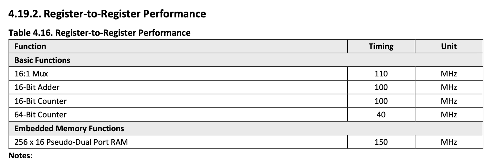

# pwm_phase_correct — 6 implementation variants

Six implementations of an 11-bit phase-correct, 3-channel dead-time PWM
gate generator, all functionally equivalent (modulo a few cycles of
pipeline latency and the `dt/2`-cycle gate-edge phase shift discussed
under "Functional equivalence" below).

All six are designed for iCE40 UP5K (sg48) and synthesise standalone
against an 85 MHz target.

## Two design axes

The six variants are arranged on a 3×2 grid:

|  | **Asymmetric dead-time** | **Symmetric dead-time** (`_sym`) |
|---|---|---|
| **Pipelined** (registered passthrough of addr) | `pwm_phase_correct_pipelined.v` | `pwm_phase_correct_pipelined_sym.v` |
| **Twin** (independent up/down counters)        | `pwm_phase_correct_twin.v`      | `pwm_phase_correct_twin_sym.v`      |
| **BRAMs** (4096-entry lookup table)            | `pwm_phase_correct_brams.v`     | `pwm_phase_correct_brams_sym.v`     |

**Counter-source axis** (rows) — how the up- and down-going counter values
are produced:

- **pipelined**: addr increments freely; `counter_up_reg <= addr[10:0]`
  and `counter_down_reg <= ~addr[10:0]` (just registered passthroughs).
  Acts as a fabric-placement anchor near the comparator cluster.
  4-stage pipeline addr → gate.
- **twin**: two independent 11-bit counters, one incrementing and one
  decrementing every cycle. Each has its own carry chain placed
  independently. Invariant: `counter_up_reg + counter_down_reg ≡ 2047
  (mod 2048)`. 3-stage pipeline counter_reg → gate.
- **brams**: a 4096-entry × 13-bit ROM holds the entire triangle plus
  sync + direction bits; a 12-bit address counter free-runs through it.
  No add/sub or boundary logic in fabric. 5-stage pipeline addr → gate.

**Dead-time placement axis** (columns) — how the dead-time gap between
high-side OFF and low-side ON is positioned:

- **Asymmetric** (default): gate transitions land at `counter = duty`
  (high) and `counter = duty ± dt` (low). Dead-time sits beside `duty`,
  on the "outside" of the rising/falling edge in each half.
  - Fast-domain stores 3 duty values per phase: `duty`, `duty−dt`,
    `duty+dt`.
- **Symmetric** (`_sym`): dead-time is centered on `duty`. Gate
  transitions land at `counter = duty ± dt/2`. The `duty_X` register
  itself is no longer needed in fabric — only `duty±dt/2` are kept.
  - Fast-domain stores 2 duty values per phase: `duty−dt/2`,
    `duty+dt/2`.
  - In the **brams_sym** variant, the gate-FF direction mux disappears
    entirely (both halves of the triangle compare against the same two
    thresholds), which also drops the direction pipeline and one
    compare lane per phase.

## Common interface

All six modules share the same Verilog port shape:

```verilog
module pwm_phase_correct_<variant> (
    input  wire        clk,
    input  wire        rst_n,
    input  wire [N:0]  bus_ctrl,   // 3:0 for asymmetric, 2:0 for _sym
    input  wire [10:0] bus,
    output reg         sync,
    output reg         gate_uh,
    output reg         gate_ul,
    output reg         gate_vh,
    output reg         gate_vl,
    output reg         gate_wh,
    output reg         gate_wl
);
```

**Bus protocol** — the slow domain pre-computes the duty thresholds
(saturating arithmetic) and pushes them in serially:

| bus_ctrl | Asymmetric (9 writes/period) | Symmetric (6 writes/period) |
|---|---|---|
| 0 | `duty_u`            | `duty_u_minus_dt_half` |
| 1 | `duty_v`            | `duty_u_plus_dt_half`  |
| 2 | `duty_w`            | `duty_v_minus_dt_half` |
| 3 | `duty_u_minus_dt`   | `duty_v_plus_dt_half`  |
| 4 | `duty_u_plus_dt`    | `duty_w_minus_dt_half` |
| 5 | `duty_v_minus_dt`   | `duty_w_plus_dt_half`  |
| 6 | `duty_v_plus_dt`    | (unused) |
| 7 | `duty_w_minus_dt`   | (unused) |
| 8 | `duty_w_plus_dt`    | (unused) |

The `brams` variants additionally depend on a ROM init file at
`build/counter_table.hex`, generated by
[scripts/gen_counter_rom.py](../scripts/gen_counter_rom.py). The
non-BRAM variants need no external data.

## Performance (post-route, single nextpnr run, 85 MHz target)

| Variant | Fmax | Critical path | LCs | BRAMs | SB_IO | SB_GB |
|---|---|---|---|---|---|---|
| pipe       | **100.67 MHz** | 9.93 ns (4.65 / 5.28) | 374 | 0  | 24 | 2 |
| pipe_sym   | 94.51 MHz      | 10.58 ns (4.65 / 5.93) | 335 | 0  | 23 | 2 |
| twin       | **100.67 MHz** | 9.93 ns (4.65 / 5.28) | 374 | 0  | 24 | 2 |
| **twin_sym**  | **100.67 MHz** | 9.93 ns (4.65 / 5.28) | **334** | 0  | 23 | 2 |
| brams      | 95.46 MHz      | 10.48 ns (4.65 / 5.83) | 309 | 13 | 24 | 3 |
| **brams_sym** | **100.67 MHz** | 9.93 ns (4.65 / 5.28) | **216** | 12 | 23 | 3 |

Logic / routing split shown in parentheses. All six pass the 85 MHz
constraint with margin.

**Critical-path source per variant** (the flop driving the slowest
register-to-register hop):

- pipe        : `gate_ul` (gate-mux fabric)
- pipe_sym    : `dir_d1`  (dir pipeline)
- twin        : `gate_ul`
- twin_sym    : `dir_d0`
- brams       : `s1_direction` (direction pipeline driving carry chain)
- brams_sym   : `gate_ul`

**Note on variance**: nextpnr's placement isn't perfectly deterministic
across runs. The numbers in this table are from one run each;
individual variants can shift ±1–5 MHz between runs. The qualitative
ordering (which variants tie at 100.67 MHz vs lag) has been stable in
the runs observed.

## Symmetric-dead-time savings

The `_sym` variants drop the fast-domain `duty_X` register entirely
because every compare references `duty ± dt/2` instead of `duty`. Net
effect per family:

| | LC change | BRAM change | Fmax change |
|---|---|---|---|
| pipe → pipe_sym   | −39 LCs | 0 | −6.16 MHz |
| twin → twin_sym   | −40 LCs | 0 | 0 |
| brams → brams_sym | **−93 LCs** | **−1 BRAM** | **+5.21 MHz** |

The brams_sym savings are larger because eliminating the direction-mux
also eliminates:
- one full compare lane per phase (3 × 3 sub-compare flops + 3 combine
  flops)
- the `s1_direction` / `s2_direction` pipeline flops
- the direction-bit slot in the BRAM table (12-bit table instead of
  13-bit, saving a BRAM column)

## Functional equivalence

All six variants produce the same gate waveform:

- Same triangle counter sequence: 0 → 2047 → 0 with 1-cycle dwells at
  peak and trough.
- Same period: 4096 fast-clock cycles.
- Same total gate-high ON-time per period: `2·duty − dt`.
- Same total dead-time per period: `2·dt`.

They differ only in:
- **Absolute pipeline latency** from `addr` to gate FF: 3 cycles (twin),
  4 cycles (pipelined), 5 cycles (brams). Externally invisible.
- **Sync-to-gate offset**: differs by up to 1 cycle between variants
  (twin, brams = 2-cycle offset; pipelined = 3-cycle offset). ~20 ns at
  50 MHz, negligible against the ~82 µs PWM period.
- **Gate-edge timing**: asymmetric variants place gate edges at
  `counter = duty` (high) and `counter = duty ± dt` (low). Symmetric
  variants place all edges at `counter = duty ± dt/2`. **Same pulse
  width**, edges shift by `dt/2` cycles (~500 ns at 50 MHz with `dt=50`).
  For motor control where average duty drives the output voltage, this
  is invisible.

A deeper functional-equivalence analysis is in the conversation thread
that built these variants; the short version is that the gate waveforms
are time-shifted versions of one another with no shape difference.

## Picking a variant

| If you need… | Pick |
|---|---|
| Minimum LCs, BRAMs available, max Fmax | **brams_sym** (216 LCs, 12 BRAMs, 100.67 MHz) |
| Max Fmax with all BRAMs free for other use | **twin_sym** (334 LCs, 0 BRAMs, 100.67 MHz) |
| Cycle-exact match with prior asymmetric code | `pipe`, `twin`, or `brams` (no edge phase shift) |
| Simplest source code | `pwm_phase_correct_pipelined.v` (registered passthrough; no carry chains in counter sources, no BRAM init files, no direction-mux removal trickery) |

## Build targets

The repository [Makefile](../Makefile) provides one target per variant:

```
make pipe          make pipe_sym
make twin          make twin_sym
make brams         make brams_sym
make variant_compare    # builds all six, prints the comparison
```

Each target writes its `nextpnr` log to `build/<variant>.nextpnr.log`.

`make brams`, `make brams_sym`, and `make variant_compare` will also
generate `build/counter_table.hex` if it doesn't already exist (via
`scripts/gen_counter_rom.py`).

## Primitives


